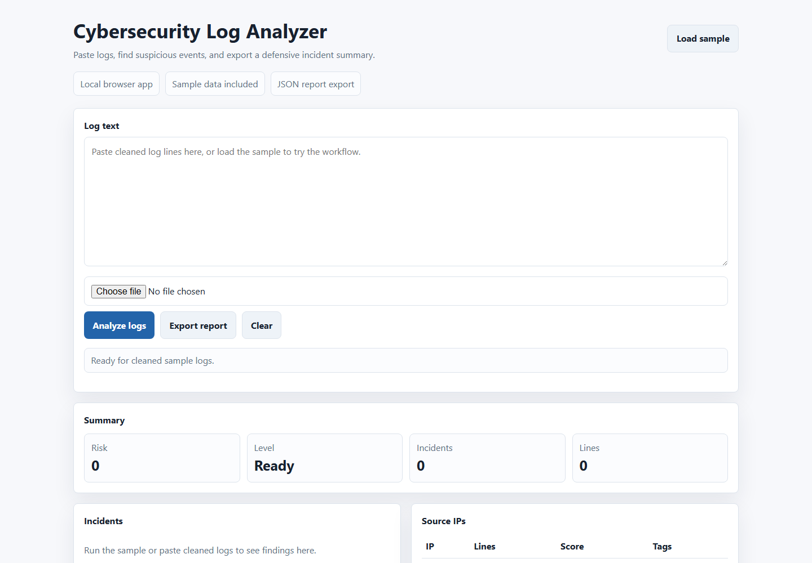

# Cybersecurity Log Analyzer

A small browser tool for reviewing sample server and sign-in logs. It highlights repeated failures, suspicious paths, privilege-related wording, and repeated source IPs, then turns the matches into a simple risk summary.

I built this as a beginner blue-team project because log review is one of the first practical skills in security work: read the evidence, group the activity, and explain what looks unusual.

## Screenshot



## Run

Open `index.html` in a browser.

## Testing

```bash
npm test
```

The test checks JavaScript syntax, required project files, README sections, screenshot presence, and old template/security placeholder wording.

## What It Does

- Accepts pasted or uploaded `.txt` and `.log` files.
- Uses clear rule-based checks instead of hidden scoring.
- Groups findings by source IP where possible.
- Shows matched evidence and response notes.
- Shows a short analyst checklist after each run.
- Exports a JSON report for later review.

## Completion Status

This is complete as a beginner browser-based blue-team project. It has a sample log, visible scoring, response notes, export, screenshot, and a smoke test.

## Safety Note

Use sample logs or logs you are allowed to review. Do not upload real customer, school, or workplace logs unless they have been cleaned first.

## What I Learned

- Small detection rules are easier to trust when the matched evidence is shown beside the result.
- A log tool is more useful when it explains why something was flagged, not just that it was flagged.
- Even a simple browser app needs tidy sample data to feel finished.

## Next Improvements

- Add a few more sample logs for failed sign-ins, web probes, and normal traffic.
- Add highlighted evidence inside the pasted log text.
- Add rule toggles for comparing different detection ideas.

## Portfolio Notes

I added a short portfolio note for the defensive log-analysis workflow in [docs/portfolio-notes.md](docs/portfolio-notes.md).
